

# Retro Portfolio

### *macOS System 7 Inspired Interactive Desktop Experience*

[About](#about) • [Features](#features) • [Screenshots](#screenshots) • [Tech Stack](#tech-stack)

---

## About

A fully functional desktop environment inspired by the iconic macOS System 7, reimagined with modern web technologies. This interactive portfolio transforms your browser into a nostalgic computing experience, complete with draggable windows, retro games, and authentic System 7 aesthetics.

<table>
<tr>
<td width="33%" align="center">

Pixel-perfect recreation  
Classic System 7 UI  
Retro color schemes  
Nostalgic experience

</td>
<td width="33%" align="center">

Built with Next.js 16  
TypeScript & React 19  
Optimized performance  
Production-ready code

</td>
<td width="33%" align="center">

Fully functional desktop  
Draggable windows  
Built-in applications  
Retro gaming included

</td>
</tr>
</table>

**What makes this special:**  
Every pixel, interaction, and animation is crafted to evoke nostalgia while delivering a smooth, contemporary user experience. From window management to touch gestures, this project bridges the gap between classic computing and modern web capabilities.

---

## Features

<table>
<tr>
<td width="33%" valign="top">

- Draggable and resizable windows
- Minimize, maximize, close
- Window snapping to edges
- Multi-window management
- Desktop icon organization
- Right-click context menu

</td>
<td width="33%" valign="top">

- Multiple theme colors
- Custom wallpapers
- Adjustable icon sizes
- Dark/Light mode support
- Personalized layouts
- User preference saving

</td>
<td width="33%" valign="top">

- **Snake** - Arcade game
- **Minesweeper** - Logic puzzle
- **Tetris** - Block stacking
- **Chrome Dino** - Endless runner
- Score tracking included

</td>
</tr>
<tr>
<td width="33%" valign="top">

- **Görkem Exchange** - Crypto trading platform
- **Terminal** - Command-line interface
- **Calculator** - Standard operations
- **File Manager** - Browse files
- **Text Editor** - Create documents
- **Weather** - Real-time info
- **Gallery** - Image viewer

</td>
<td width="33%" valign="top">

- About page with introduction
- Projects showcase
- Career timeline
- Blog with articles
- Contact information
- GitHub integration

</td>
<td width="33%" valign="top">

- Keyboard shortcuts
- Touch gestures support
- Full keyboard navigation
- Screen reader friendly
- Responsive design
- Bilingual (EN/TR)

</td>
</tr>
</table>

---

## Screenshots

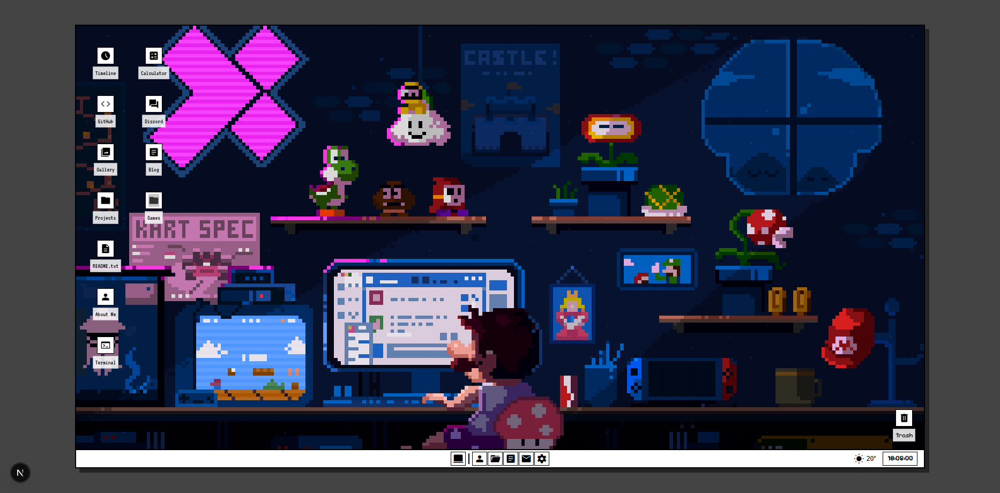

*Main desktop with draggable windows and taskbar*

  

<table>
<tr>
<td width="50%">
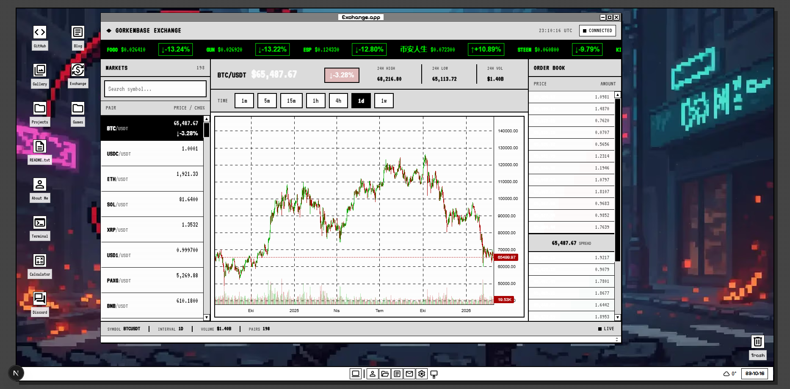

<b>Exchange Application</b>

<td width="50%">
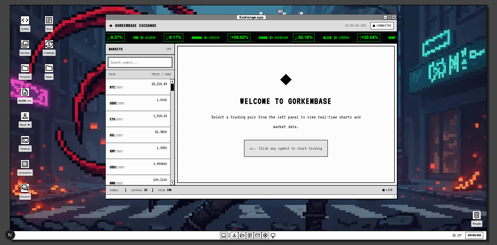

<b>Görkem Exchange - Crypto Trading</b>

</tr>
<tr>
<td width="50%">
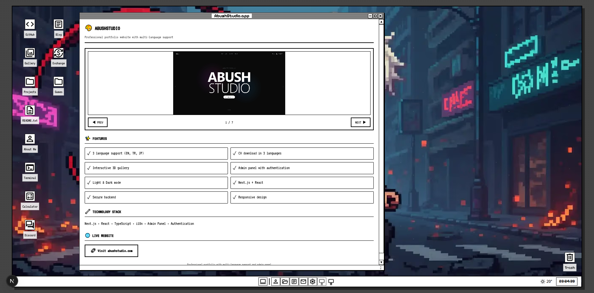

<b>Project Showcase</b>

</td>
<td width="50%">

<b>Theme Customization</b>

</td>
</tr>
<tr>
<td width="50%">
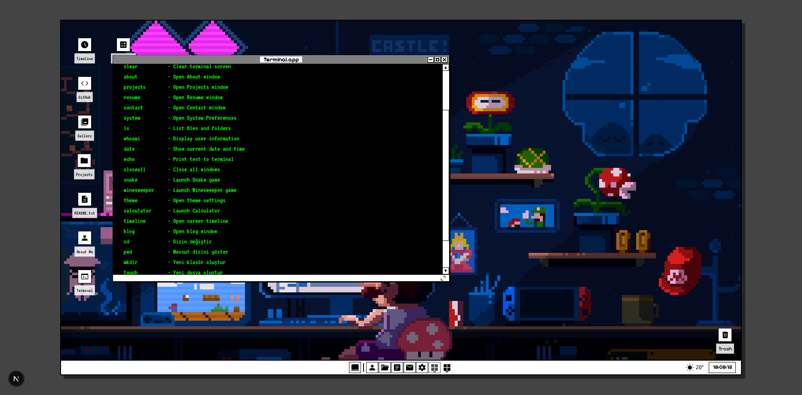

<b>Terminal Application</b>

</td>
<td width="50%">
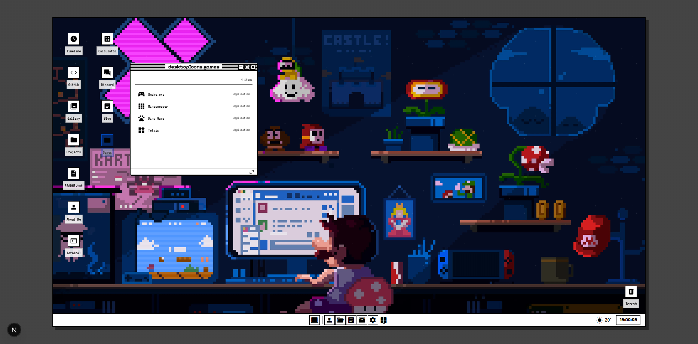

<b>Built-in Games</b>

</td>
</tr>
</table>

<b>View More Screenshots</b>

 

<table>
<tr>
<td width="33%">
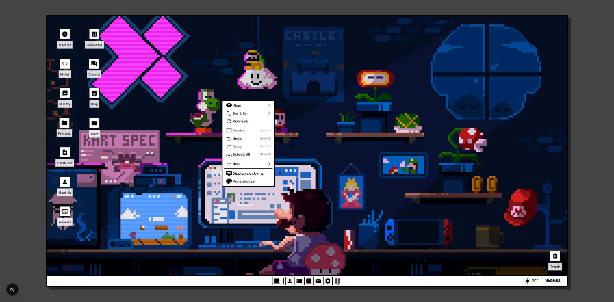

Context Menu

</td>
<td width="33%">
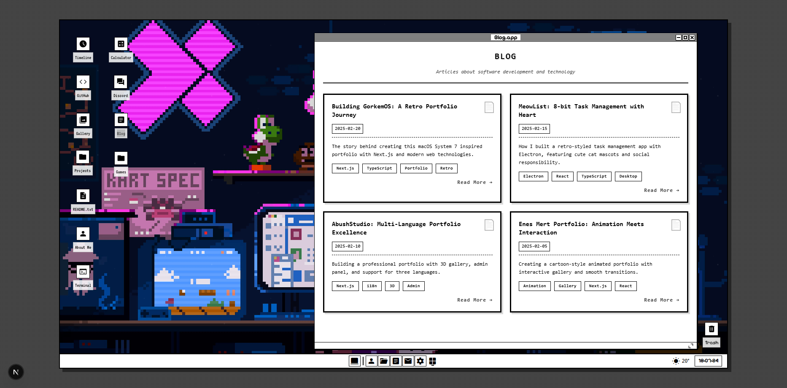

Blog Section

</td>
<td width="33%">
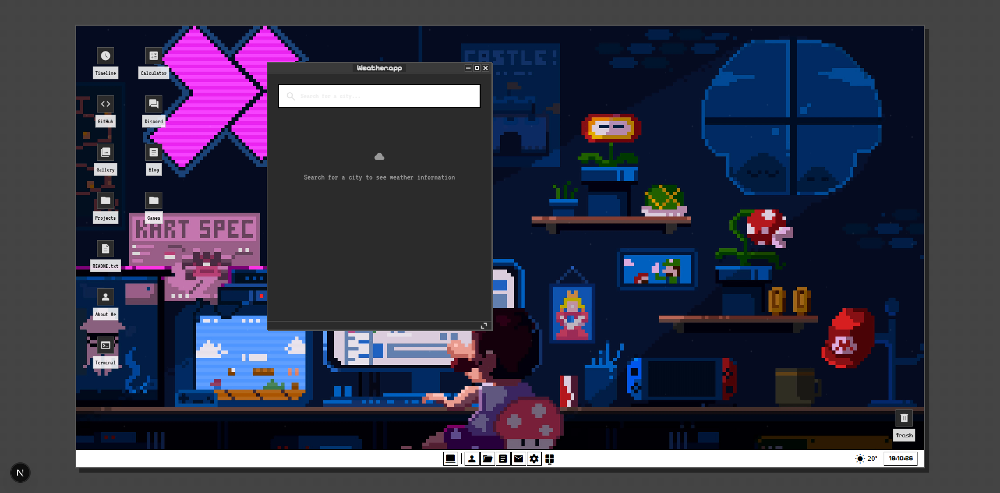

Weather Widget

</td>
</tr>
<tr>
<td width="33%">
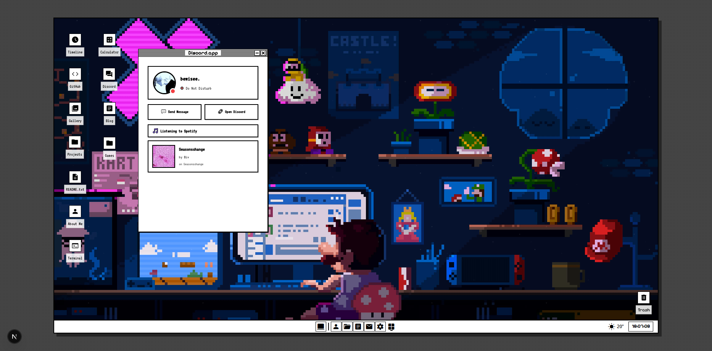

Discord Status

</td>
<td width="33%">
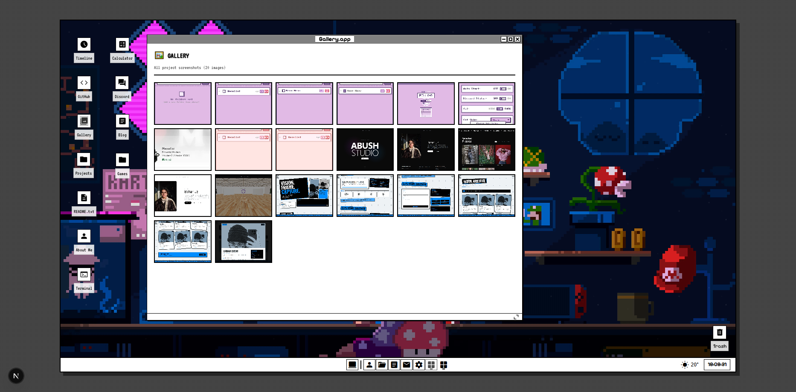

Image Gallery

</td>
<td width="33%">
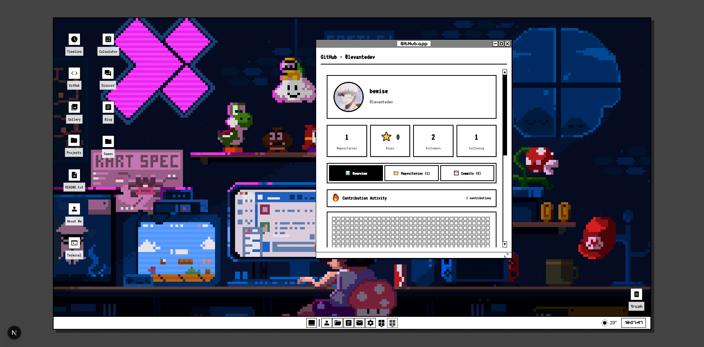

GitHub Profile

</td>
</tr>
</table>

---

## 🚀 Görkem Exchange - Cryptocurrency Trading Platform

<table>
<tr>
<td width="50%">

<i>Main trading interface with real-time market data</i>

</td>
<td width="50%">

<i>Interactive price charts and technical analysis</i>

</td>
</tr>
</table>

 

<table>
<tr>
<td width="25%" align="center">

Live cryptocurrency prices  
WebSocket integration  
Instant market updates  
Multiple trading pairs  
Order book depth

</td>
<td width="25%" align="center">

Custom chart library  
Multiple timeframes  
Technical indicators  
Price history tracking  
Candlestick patterns

</td>
<td width="25%" align="center">

Buy/Sell orders  
Portfolio tracking  
Transaction history  
Market analysis  
Price alerts

</td>
<td width="25%" align="center">

All retro themes supported  
Dark/Light mode  
Responsive design  
Retro UI elements  
System 7 aesthetics

</td>
</tr>
</table>

**About Görkem Exchange:**  
A fully functional cryptocurrency exchange platform seamlessly integrated into the retro desktop environment. Built with modern web technologies while maintaining the nostalgic System 7 aesthetic. Features real-time market data, interactive charts, and professional trading tools - all wrapped in a vintage computing experience.

 

**Technical Highlights:**

<table>
<tr>
<td width="20%" align="center">

Real-time connections  
Live price updates  
Instant data sync

</td>
<td width="20%" align="center">

No third-party libs  
Built from scratch  
Full control

</td>
<td width="20%" align="center">

Mobile-friendly  
Touch optimized  
All screen sizes

</td>
<td width="20%" align="center">

All themes supported  
Color schemes  
Perfect integration

</td>
<td width="20%" align="center">

Fast & smooth  
60fps animations  
Optimized code

</td>
</tr>
</table>

---

## Tech Stack

| Technology | Purpose |
|------------|---------|
|  | React framework with App Router |
|  | Type-safe development |
|  | UI component library |
|  | Utility-first styling |
|  | Internationalization (i18n) |

---

## Performance

<table>
<tr>
<td width="33%" align="center">

Performance: **95+**  
Accessibility: **90+**  
Best Practices: **95+**  
SEO: **100**

</td>
<td width="33%" align="center">

Code splitting & lazy loading  
Image optimization (AVIF, WebP)  
Bundle size under 200KB  
Smooth 60fps animations

</td>
<td width="33%" align="center">

WCAG 2.1 AA compliant  
Full keyboard navigation  
Screen reader support  
High contrast mode

</td>
</tr>
</table>

---

## Internationalization

<table>
<tr>
<td width="50%" align="center">

🇬🇧 Complete translation  
✅ 100% coverage  
All UI elements localized

</td>
<td width="50%" align="center">

🇹🇷 Native language support  
✅ 100% coverage  
Seamless language switching

</td>
</tr>
</table>

---

## License

This project is created for portfolio purposes. All rights reserved.

---

**Made with ❤️ by Görkem**

*Bringing retro computing to the modern web*

 

> **Note:** This repository contains project documentation and screenshots only. Source code is private.

